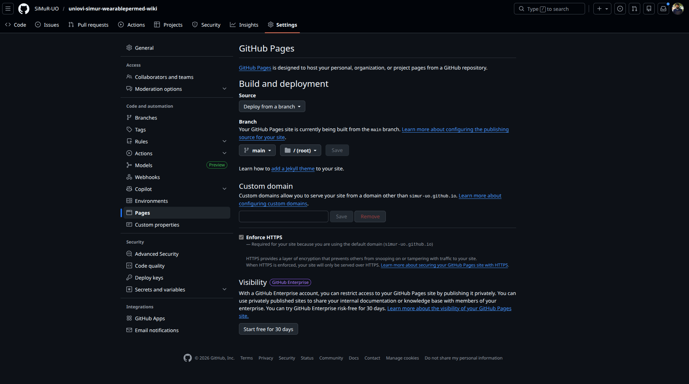

# Description
Documentation about Github Pages and create your own Wikis deployed under Github using a CI/CD actions pipelines to update your wiki.

# Steps

- **STEP 01**: Create a wiki repo
You can create the repo from git-hub from portal and clone or follow these steps to initialize the repo locally and push the main branch 

```bash
$ mkdir uniovi-simur-wearablepermed-wiki
$ cd uniovi-simur-wearablepermed-wiki
$ git init
$ echo 'uniovi-simur-wearablepermed-wiki' > README.md
$ git add .
$ git commit -m "Initial commit"
$ git remote add origin https://github.com/SiMuR-UO/uniovi-simur-wearablepermed-wiki.git
$ git branch -M main
$ git push -u origin main
```

- **STEP 02**: You must select a theme for your pages site
In my case I will use the theme [just-the-docs](https://just-the-docs.com/). Read the documentation to configure your pages site

- **STEP 03**: Configure the repo as pages
We must edit the settings of our repo and configure the branch to se used by actions github each time we update the code of our pages site

We can keep all arguments as default, only select the branch argument and select `main` branch and `/(root)` as main folder. When save this argument automatically an action pipeline will be triggered and start to clone, compile and publish our site under github domain. Now each time push code to the main branch, a new pipeline will be triggered to deploy the last changes.

After deploye if not exist any error in our code a new uri will be created by github to access to our new pages site unde our account and repo name like this:

```bash
https://simur-uo.github.io/uniovi-simur-wearablepermed-wiki/
```



- **STEP 04**: Start document

The theme selected use markdown to code the pages. We must create a `_config.yml` where configure select and configure the theme. This file will be use by the action pipeline in compilation steop. This is an example of it


```bash
# 1. Use the official, maintained theme to avoid 'nav.html' errors
remote_theme: just-the-docs/just-the-docs

title: WearablePerMed Wiki
description: WearablePerMed Documentation

# 2. Plugins section (Corrected)
plugins:
  - jekyll-remote-theme

search_enabled: true
search:
  # Split pages into sections that can be searched individually
  # Supports 1 - 6, default: 2
  heading_level: 2
  # Maximum amount of previews per search result
  # Default: 3
  previews: 2
  # Maximum amount of words to display before a matched word in the preview
  # Default: 5
  preview_words_before: 3
  # Maximum amount of words to display after a matched word in the preview
  # Default: 10
  preview_words_after: 3
  # Set the search token separator
  # Default: /[\s\-/]+/
  # Example: enable support for hyphenated search words
  tokenizer_separator: /[\s/]+/
  # Display the relative url in search results
  # Supports true (default) or false
  rel_url: true
  # Enable or disable the search button that appears in the bottom right corner of every page
  # Supports true or false (default)
  button: false

# Aux links for the upper right navigation
aux_links:
  "SiMuR-UO on GitHub":
    -  https://github.com/SiMuR-UO

# Back to top link
back_to_top: true
back_to_top_text: Inicio

footer_content: "Esta documentación tiene licencia <a href=\"https://www.gnu.org/licenses/gpl-3.0.html\">GNU General Public License v2.0</a>"
```